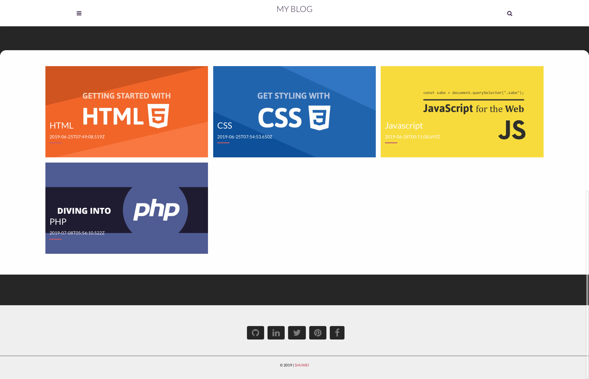

# personal-blog
adonisjs, nodejs, MongoDB, rest-admin API, admin dashboard


## Setup

Use the adonis command to install the blueprint

```bash
adonis new yardstick
```

or manually clone the repo and then run `npm install`.


### Migrations

Run the following command to run startup migrations.

```js
adonis migration:run
```


## run

```bash
adonis serve --dev
```

| -                                                                                       | -                                 
| -------------------------------------------------------------------------------------------------------------------------- |
|                                             Home Page                                              | 
